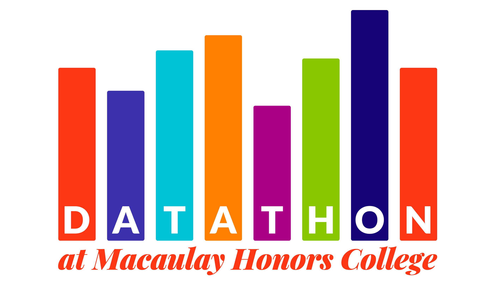

# DataVengers' Submission for MHC Datathon 2025!

In this project, we examine the effects of congestion pricing on the number of ACE violations for exempt vehicles, and breaking it down by monthly trends as well as locations. We also explore the effects of congestion pricing on bus speeds as well as Citi Bike ridership.

**DataVengers: Saajid Al Wajid,  Mari Kathleen Abdon, Akram Uddin, Jin Wang**

